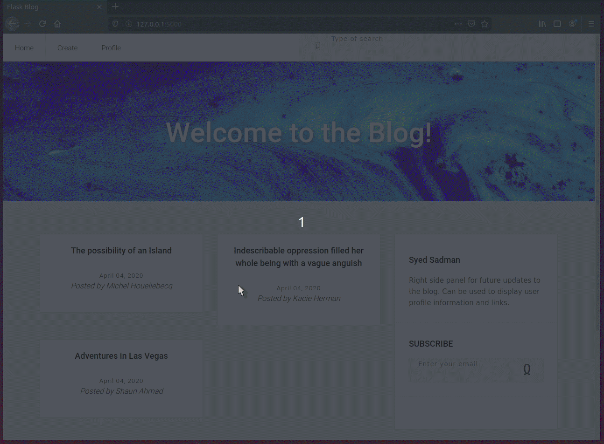

# Flask Blog

Minamalistic blog created using Python Flask as a backend and Html/Css as the frontend


Preview             
:-------------------------:
 


## Notes
Personal notes taken while working on project


#### Basics
- Convert html templates to use jinga 
- View functions handle application routes to different URLs. These are called decorators (@app.route) which load a URL to a web page and execute functions and logic defined. 
```Python
 @app.route('/index')
 def index():
     return "Hello, World!"
```
- Templates help create seperation between design and logic. Template folder contains HTML. 
- Static folder is where JavaScript and CSS are stored


#### Variables
- Variables for dynamic content represented by {{ ... }} which is only known at runtime. 
```python
 '{{ url_for('static', filename='file.css') }}'
```
- To set value of variables, define it when the template is rendered as parameters of the render_template method. 
```python
 <title>{{ title }} - Microblog</title>
 <h1>Hello, {{ user.username }}!</h1>
```
```python
 @app.route('/index')
 def index():
     user = {'username': 'Miguel'}
     return render_template('index.html', title='Home', user=user)
```

***

#### Conditionals
If/Else loops
```python
  
      <title>{{ title }} - Microblog</title>
  
      <title>Welcome to Microblog!</title>
  
```

For loops 
- Arraays can be defined inside app.py file. It should be passed to appropriate template when rendering  
```python
 posts = [
        {
            'author': {'username': 'John'},
            'body': 'Beautiful day in Portland!'
        },
        ....
    ]
    return render_template("index.html", posts=posts)
```
- Inside html, each object can be retrieved by the following:
```python
 
     <div><p>{{ post.author.username }} says: <b>{{ post.body }}</b></p></div>
 
```

***


#### Input from Forms
Define form with method type and url for the route

```python
 <form method="POST" action="{{ url_for('submit') }}" class="...">
```
Handle form data inside function

```python
@app.route('/submit', methods=['POST'])
def submit():
```

***

#### Setting up a database
Flask gives freedom in choosing database. Using SQLAlchemy since its a conventient choice to run quickly on desktop instead of using an online server

Steps:
- install database with pip and import it into project
- set up the database location

```bash
basedir = os.path.abspath(os.path.dirname(__file__))
app.config['SQLALCHEMY_DATABASE_URI'] = 'sqlite:///' + os.path.join(basedir, 'database.db')
```

In directory where app is installed, intitiate database
```bash
sqlite3 [database_name].db
.tables // To save the database
.exit
```

```bash
from app import db
db.create_all()
exit()
```

***

#### Saving data to database
Once database is setup, now create a way for the database content to be saved and displayed. 

- First, create a model class to hold the infromation and save to database 
```python
class ClassName(db.Model):
  id = db.Column(db.Integer, primary_key=True)
  title = db.Column(db.String(30))
  name = db.COlumn(db.Text)
  .... 
```

- When the form is being sumbitted, that needs another route. Import 'request' into flask. Now create the function and specify the method. By default its GET so make this POST since uploading data. 
```python
@app.route('/submit', methods=['POST'])
def submit():
  title = request.form['title']
  name = request.form['name']

  post = Classname(title=title, name=name)
  db.session.add(post)
  db.session.commit()
  return redirect(url_for('index'))
  ```

- To check data that was entered, can do the following:
```Python
    return "'<h1>Title: {} Name: {} </h1>'".format(title, name) 
```
- Or in terminal
```bash
    sqlite database.db
    .tables
    select * from [table_name]
```

- Specify which form the function is being called on
```Python
  <form name="addForm" id="addForm" method="POST" action="{{ url_for('submit') }}" novalidate>
```

***

#### Retrieve single database entry
Once everythign is saved, the data should be displayed. 

- To retrieve a specific database entry, the idea is to get the id and query the database. 
- In the html file, reference the function and assign the post.id to a variable

```python 
<a href="{{ url_for('display', post_id = post.id) }}">
```
- Set up a function for the id and query the database to get only one entry using .one(). This specific entry can now be used in another template. 

```python
@app.route('/display/<int:post_id>')
def display(post_id):
  post = BlogEntry.query.filter_by(id=post_id).one()
  return render_template('viewposts.html', post=post)
```

viewposts.html
```python
<div>
  <h1> {{ post.title }} </h1>
  <h1> My name is {{ post.name }} </h1>
  ....
  {{ post.content|safe }} 
```
- Safe keyword prevents < > tags from being shown and formats it correctly. Also prevents others from typing in html and loading it. 

***

#### Retrieve all data
Multiple posts from the database

- Create a function to query all posts and sort them based on date
```python
@app.route('/')
def index():
  posts = BlogEntry.query.order_by(BlogEntry.date.desc()).all()
  return render_template('index.html', posts=posts)
```
- Set up loop inside html to display each element as a div
```python
<div class=container>
  
    ....
    {{ post.title }} 
  
</div>
```

***

## Resources Used

https://blog.miguelgrinberg.com/post/the-flask-mega-tutorial-part-ii-templates
https://flask-sqlalchemy.palletsprojects.com/en/2.x/models/


